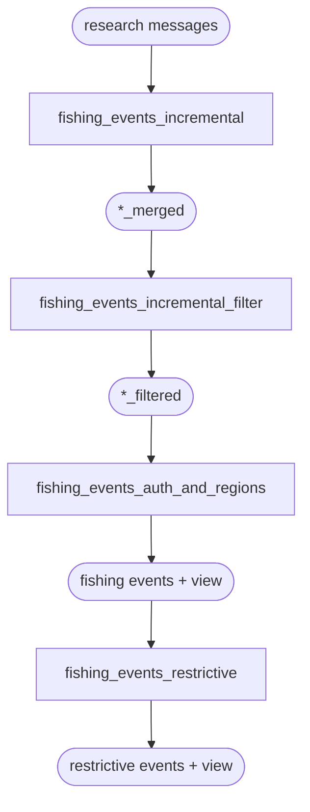

<h1 align="center" style="border-bottom: none;"> pipe-events </h1>

<p align="center">
  <a href="https://codecov.io/gh/GlobalFishingWatch/pipe-events">
    
  </a>
  <a>
    
  </a>
  <a>
    
  </a>
</p>

This repository contains the **events pipeline**, which extracts summarized events
(fishing, encounters, loitering and port visits) from the datasets produced by the
Global Fishing Watch AIS pipeline. Each command reads its inputs from BigQuery,
summarizes them, and writes the result back to a BigQuery table.

All commands are exposed through a single command-line interface (`pipe-events`), which
is shipped as a Docker image so you don't need a local Python environment to run it.

[git workflow documentation]: GITHUB-FLOW.md

## Table of contents

- [Pipeline overview](#pipeline-overview)
- [Requirements](#requirements)
- [Setup](#setup)
- [Running the pipeline](#running-the-pipeline)
  - [Global options](#global-options)
- [CLI reference](#cli-reference)
  - [`fishing_events_incremental`](#fishing_events_incremental)
  - [`fishing_events_incremental_filter`](#fishing_events_incremental_filter)
  - [`fishing_events_auth_and_regions`](#fishing_events_auth_and_regions)
  - [`fishing_events_restrictive`](#fishing_events_restrictive)
  - [`encounter_events`](#encounter_events)
  - [`loitering_events`](#loitering_events)
  - [`port_visit_events`](#port_visit_events)
- [Development](#development)
  - [Manual end-to-end testing](#manual-end-to-end-testing)
- [Git workflow](#git-workflow)
- [License](#license)

## Pipeline overview

The CLI exposes seven subcommands that fall into two groups.

**Incremental fishing events** is a four-step chain. Only the first step is genuinely
incremental; the rest are transformations that refine its output. The first two steps
run twice each — once for `nnet_score` and once for `night_loitering` — because at that
point the vessel's shiptype is not yet known.

| Subcommand | Output | What it does |
|---|---|---|
| `fishing_events_incremental` | `*_merged` table | Opens a BigQuery session, computes fishing events for the input date range (loading the day before `--start-date` as padding), and merges them into the historical merged-events table, stitching overlapping events together. Runs once per score field. |
| `fishing_events_incremental_filter` | `*_filtered` table | Applies segment noise filters, keeps potential fishing vessels, and drops events that don't meet the fishing-event criteria (e.g. minimum duration). Runs once per score field. |
| `fishing_events_auth_and_regions` | versioned table + view | Combines the `nnet_score` and `night_loitering` filtered events into a single table and adds authorization and region information. |
| `fishing_events_restrictive` | versioned table + view | Applies the more restrictive `prod_shiptype='fishing'` filter required by the API. |

**Standalone event publishers** each read their sources and publish one versioned events
table plus a view pointing at the latest version:

| Subcommand | Output | What it does |
|---|---|---|
| `encounter_events` | versioned table + view | Publishes encounter events enriched with vessel identity, authorization and region information. |
| `loitering_events` | versioned table + view | Publishes loitering events enriched with vessel info and region information. |
| `port_visit_events` | versioned table + view | Publishes port visit events (intermediate anchorage as mean position). |

How data flows through the incremental fishing events chain (rectangles are subcommands,
rounded nodes are BigQuery tables):



## Requirements

You only need [Docker](https://www.docker.com/) and the
[Docker Compose](https://docs.docker.com/compose/) plugin. No other dependency is
required to run the pipeline.

## Setup

The pipeline reads its input from BigQuery, so you must first authenticate with your
Google Cloud account. Credentials are stored in a Docker volume named `gcp` that is
shared across pipeline repositories, so you only need to do this once per machine:

```shell
make docker-gcp
```

This creates the credentials volume, runs the application-default login flow, and sets
the billing/quota project (`world-fishing-827`). Follow the printed instructions.

Then build the image:

```shell
make docker-build
```

## Running the pipeline

The `pipe-events` entrypoint lives inside the image, so you select it with
`--entrypoint` on the `pipeline` service:

```shell
docker compose run --rm --entrypoint pipe-events pipeline [global options] <subcommand> [subcommand options]
```

To see the options accepted by a subcommand, pass `--help` to it:

```shell
docker compose run --rm --entrypoint pipe-events pipeline fishing_events_incremental --help
```

### Global options

These options are parsed **before** the subcommand token and apply to every subcommand:

| Option | Required | Description |
|---|---|---|
| `--project` | yes | GCP project id billed for executing the BigQuery work. |
| `--table-description` | no | Extra text appended to the output table description. Default: empty. |
| `--dry-run` | no | Print the queries and exit without running them. |
| `-v`, `--verbose` | no | Verbose output; repeat (`-vv`) for more. |
| `-q`, `--quiet` | no | Quiet output (errors only). |

A full invocation therefore looks like:

```shell
docker compose run --rm --entrypoint pipe-events pipeline \
  -v --project world-fishing-827 --table-description "Incremental fishing events" \
  fishing_events_incremental --start-date 2020-01-01 --end-date 2020-01-10 ...
```

## CLI reference

Every table option takes a **fully-qualified** `project.dataset.table` value, and
`--bq-in-udfs-dataset` takes a `project.dataset`. All subcommand options below are
required unless noted; the [global options](#global-options) above are additional.

### `fishing_events_incremental`

Computes incremental fishing (or night loitering) events for a date range and merges
them into the historical `*_merged` table inside a BigQuery session. Run once per score
field.

| Option | Required | Description |
|---|---|---|
| `--start-date` | yes | Start date of the source messages (`YYYY-MM-DD`). |
| `--end-date` | yes | End date of the source messages (`YYYY-MM-DD`). |
| `--bq-in-messages` | yes | Source messages table with fishing / night loitering scores. |
| `--score-field` | yes | Score field to evaluate: `nnet_score` or `night_loitering`. |
| `--max-fishing-event-gap-hours` | no | Max gap (hours) from the prior day used to reopen potentially open events. Default: `2`. |
| `--bq-out-merged-events` | yes | Destination merged fishing events table. |
| `--labels` | yes | JSON object string applied to the output tables. |

### `fishing_events_incremental_filter`

Applies the fishing-event filters to a merged table and writes the `*_filtered` table.
Run once per score field.

| Option | Required | Description |
|---|---|---|
| `--bq-in-merged-events` | yes | Source merged events table (output of `fishing_events_incremental`). |
| `--bq-in-segments-activity` | yes | Segments activity table. |
| `--bq-in-segment-vessel` | yes | Segment vessel table. |
| `--bq-in-product-vessel-info-summary` | yes | Product vessel info summary (PVIS) table. |
| `--product-vessel-info-summary-field-prefix` | no | Prefix for vessel info fields in the PVIS table (e.g. `ais_`; empty for VMS PVIS). |
| `--score-field` | yes | Score field to evaluate: `nnet_score` or `night_loitering`. |
| `--bq-in-udfs-dataset` | yes | Dataset (`project.dataset`) where the shared UDFs live. |
| `--bq-out-filtered-events` | yes | Destination filtered fishing events table. |
| `--labels` | yes | JSON object string applied to the output tables. |

### `fishing_events_auth_and_regions`

Combines the `nnet_score` and `night_loitering` filtered events and adds authorization
and region information, publishing a versioned table and a view.

| Option | Required | Description |
|---|---|---|
| `--bq-in-fishing-events` | yes | Filtered `nnet_score` fishing events table. |
| `--bq-in-night-loitering-events` | yes | Filtered `night_loitering` events table. |
| `--bq-in-vessel-identity-core` | yes | Vessel identity core table. |
| `--bq-in-vessel-identity-authorization` | yes | Vessel identity authorization table. |
| `--bq-in-spatial-measures` | yes | Spatial measures table. |
| `--bq-in-regions` | yes | Event regions table. |
| `--bq-in-product-vessel-info-summary` | yes | Product vessel info summary (PVIS) table. |
| `--product-vessel-info-summary-field-prefix` | no | Prefix for vessel info fields in the PVIS table (e.g. `ais_`). |
| `--bq-in-udfs-dataset` | yes | Dataset (`project.dataset`) where the shared UDFs live. |
| `--bq-out-events` | yes | Destination table (the versioned `_v<YYYYMMDD>` name derives from this and `--reference-date`). |
| `--bq-out-events-view` | yes | Destination view pointing at the latest versioned table. |
| `--reference-date` | yes | Reference date (`YYYY-MM-DD`) for the less restrictive events; drives the versioned table name. |
| `--labels` | yes | JSON object string applied to the output tables. |

### `fishing_events_restrictive`

Applies the restrictive fishing filter to the auth-and-regions output, publishing a
versioned table and a view.

| Option | Required | Description |
|---|---|---|
| `--bq-in-events` | yes | Source (less restrictive) events table; `--reference-date` is appended to resolve the versioned name. |
| `--bq-out-events` | yes | Destination restrictive events table (versioned by `--reference-date`). |
| `--bq-out-events-view` | yes | Destination view pointing at the restrictive events table. |
| `--reference-date` | yes | Reference date (`YYYY-MM-DD`) for the restrictive events; drives the versioned table name. |
| `--labels` | yes | JSON object string applied to the output tables. |

### `encounter_events`

Publishes encounter events for a date range as a versioned table and a view.

| Option | Required | Description |
|---|---|---|
| `--start-date` | yes | Start date of the source range (`YYYY-MM-DD`). |
| `--end-date` | yes | End date of the source range (`YYYY-MM-DD`); drives the versioned table name. |
| `--bq-in-encounters` | yes | Source encounters table. |
| `--bq-in-spatial-measures` | yes | Spatial measures table. |
| `--bq-in-regions` | yes | Event regions table. |
| `--bq-in-product-vessel-info-summary` | yes | Product vessel info summary (PVIS) table. |
| `--product-vessel-info-summary-field-prefix` | yes | Prefix for vessel info fields in the PVIS table (e.g. `ais_`). |
| `--bq-in-vessel-identity-core` | yes | Vessel identity core table. |
| `--bq-in-vessel-identity-authorization` | yes | Vessel identity authorization table. |
| `--bq-in-voyages` | yes | Voyages table. |
| `--bq-in-port-visits` | yes | Port visits table. |
| `--bq-out-events` | yes | Destination table; the versioned table and view derive from this. |
| `--labels` | yes | JSON object string applied to the output tables. |

### `loitering_events`

Publishes loitering events for a date range as a versioned table and a view.

| Option | Required | Description |
|---|---|---|
| `--start-date` | yes | Start date of the source range (`YYYY-MM-DD`). |
| `--end-date` | yes | End date of the source range (`YYYY-MM-DD`); drives the versioned table name. |
| `--bq-in-loitering` | yes | Source loitering table. |
| `--bq-in-segment-info` | yes | Segment info table. |
| `--bq-in-spatial-measures` | yes | Spatial measures table. |
| `--bq-in-regions` | yes | Event regions table. |
| `--bq-in-research-segments` | yes | Research segments table. |
| `--bq-in-product-vessel-info-summary` | yes | Product vessel info summary (PVIS) table. |
| `--product-vessel-info-summary-field-prefix` | yes | Prefix for vessel info fields in the PVIS table (e.g. `ais_`). |
| `--minimum-distance-from-shore-nm` | yes | Minimum distance from shore, in nautical miles. |
| `--bq-in-voyages` | yes | Voyages table. |
| `--bq-in-port-visits` | yes | Port visits table. |
| `--bq-out-events` | yes | Destination table; the versioned table and view derive from this. |
| `--labels` | yes | JSON object string applied to the output tables. |

### `port_visit_events`

Publishes port visit events for a date range as a versioned table and a view.

| Option | Required | Description |
|---|---|---|
| `--start-date` | yes | Start date of the source range (`YYYY-MM-DD`). |
| `--end-date` | yes | End date of the source range (`YYYY-MM-DD`); drives the versioned table name. |
| `--bq-in-port-visits` | yes | Source port visits table. |
| `--bq-in-product-vessel-info-summary` | yes | Product vessel info summary (PVIS) table. |
| `--product-vessel-info-summary-field-prefix` | yes | Prefix for vessel info fields in the PVIS table (e.g. `ais_`). |
| `--bq-in-spatial-measures` | yes | Spatial measures table. |
| `--bq-in-regions` | yes | Event regions table. |
| `--bq-in-named-anchorages` | yes | Named anchorages table. |
| `--bq-out-events` | yes | Destination table; the versioned table and view derive from this. |
| `--labels` | yes | JSON object string applied to the output tables. |

## Development

The project ships a Docker-based workflow driven by `make`; run `make help` for the full
list. Common entry points:

```shell
make docker-build     # build the docker image
make docker-ci-test   # run the test suite in the dev container (as CI does)
make docker-shell     # open a shell in the dev container
```

There is also a local (venv) path for linting, type-checking and tests — `make install`
then `make all` (lint + codespell + typecheck + audit + test).

### Manual end-to-end testing

The scripts under [`examples/`](examples) run the pipeline end to end against BigQuery
for manual testing. They use `docker compose` under the hood, bill the `world-fishing-827`
execution project, and tag output tables with the same development labels. Every table is
derived from an output dataset and a table prefix, so the scripts share the
`--bq-out-dataset PROJECT.DATASET` / `--bq-out-table-prefix PREFIX` naming convention.

#### Fishing events

Fishing event generation is a multi-step chain, split across two scripts that reflect how
the steps are usually tested: the incremental step on its own over a few days, and the
whole-history steps as a separate consolidated run.

##### Incremental step

[`examples/run_fishing_incremental_stages.sh`](examples/run_fishing_incremental_stages.sh)
runs `fishing_events_incremental` for both score fields (`nnet_score` and
`night_loitering`), writing one `*_merged` table per field. This is the only genuinely
incremental step and is typically tested on a couple of days at a time.

```shell
make docker-build
cd examples
./run_fishing_incremental_stages.sh \
  --start-date 2020-01-01 --end-date 2020-01-10 \
  --bq-in-messages world-fishing-827.pipe_ais_test_202408290000_internal.research_messages \
  --bq-out-dataset world-fishing-827.scratch_example \
  --bq-out-table-prefix PIPELINE12345_test
```

Each variant writes to
`<bq-out-dataset>.<bq-out-table-prefix>_<score_field>_merged`.

##### Consolidated steps

[`examples/run_fishing_consolidated_stages.sh`](examples/run_fishing_consolidated_stages.sh)
runs the whole-history chain — `fishing_events_incremental_filter` (once per score
field) → `fishing_events_auth_and_regions` → `fishing_events_restrictive` — feeding the
output of each step into the next. It takes the two `*_merged` tables produced by the
incremental step as inputs, plus the upstream reference datasets.

```shell
cd examples
./run_fishing_consolidated_stages.sh \
  --reference-date 2020-01-10 \
  --bq-in-merged-nnet-score world-fishing-827.scratch_example.PIPELINE12345_test_nnet_score_merged \
  --bq-in-merged-night-loitering world-fishing-827.scratch_example.PIPELINE12345_test_night_loitering_merged \
  --bq-in-identity-published-dataset world-fishing-827.pipe_ais_test_202408290000_published \
  --bq-in-ais-published-dataset world-fishing-827.pipe_ais_test_202408290000_published \
  --bq-in-ais-internal-dataset world-fishing-827.pipe_ais_test_202408290000_internal \
  --bq-out-dataset world-fishing-827.scratch_example \
  --bq-out-table-prefix PIPELINE12345_test
```

The identity-published dataset supplies `identity_core`, `identity_authorization` and
`product_vessel_info_summary`; the AIS-published dataset supplies `segs_activity`; the
AIS-internal dataset supplies `segment_vessel`. The UDFs dataset, spatial measures and
event regions tables default to their production locations and can be overridden with
`--bq-in-udfs-dataset`, `--bq-in-spatial-measures` and `--bq-in-regions`.

#### Other event types

The standalone publishers are each a single command, so each has its own single-command
script following the same conventions (execution project, labels and `--bq-out-dataset` /
`--bq-out-table-prefix` naming). Each writes one versioned table plus a view, derived from
`--bq-out-events`:

| Script | Command | Output table |
|---|---|---|
| [`run_encounter_events.sh`](examples/run_encounter_events.sh) | `encounter_events` | `<prefix>_encounter_events` |
| [`run_loitering_events.sh`](examples/run_loitering_events.sh) | `loitering_events` | `<prefix>_loitering_events` |
| [`run_port_visit_events.sh`](examples/run_port_visit_events.sh) | `port_visit_events` | `<prefix>_port_visit_events` |

```shell
cd examples
./run_encounter_events.sh \
  --start-date 2020-01-01 --end-date 2020-01-10 \
  --bq-in-encounters world-fishing-827.pipe_ais_test_202408290000_published.encounters \
  --bq-in-voyages world-fishing-827.pipe_ais_test_202408290000_published.voyages \
  --bq-in-port-visits world-fishing-827.pipe_ais_test_202408290000_published.port_visits \
  --bq-in-identity-published-dataset world-fishing-827.pipe_ais_test_202408290000_published \
  --bq-out-dataset world-fishing-827.scratch_example \
  --bq-out-table-prefix PIPELINE12345_test
```

The identity-published dataset supplies `product_vessel_info_summary` (and, for
encounters, `identity_core` and `identity_authorization`). Spatial measures and event
regions default to their production locations; `--pvis-field-prefix` defaults to `ais_`.
Run each script with `--help` for its full argument list.

## Git workflow

Please refer to our [git workflow documentation] to know how to manage branches in this
repository.

## License

Copyright 2017 Global Fishing Watch

Licensed under the Apache License, Version 2.0 (the "License");
you may not use this file except in compliance with the License.
You may obtain a copy of the License at

    http://www.apache.org/licenses/LICENSE-2.0

Unless required by applicable law or agreed to in writing, software
distributed under the License is distributed on an "AS IS" BASIS,
WITHOUT WARRANTIES OR CONDITIONS OF ANY KIND, either express or implied.
See the License for the specific language governing permissions and
limitations under the License.
